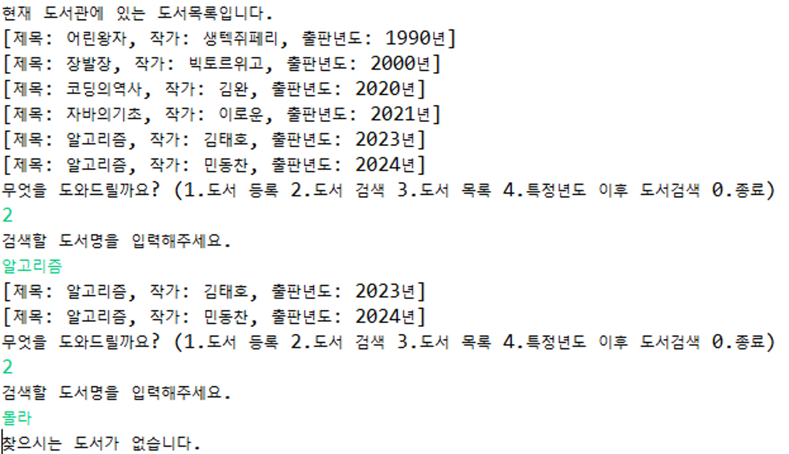
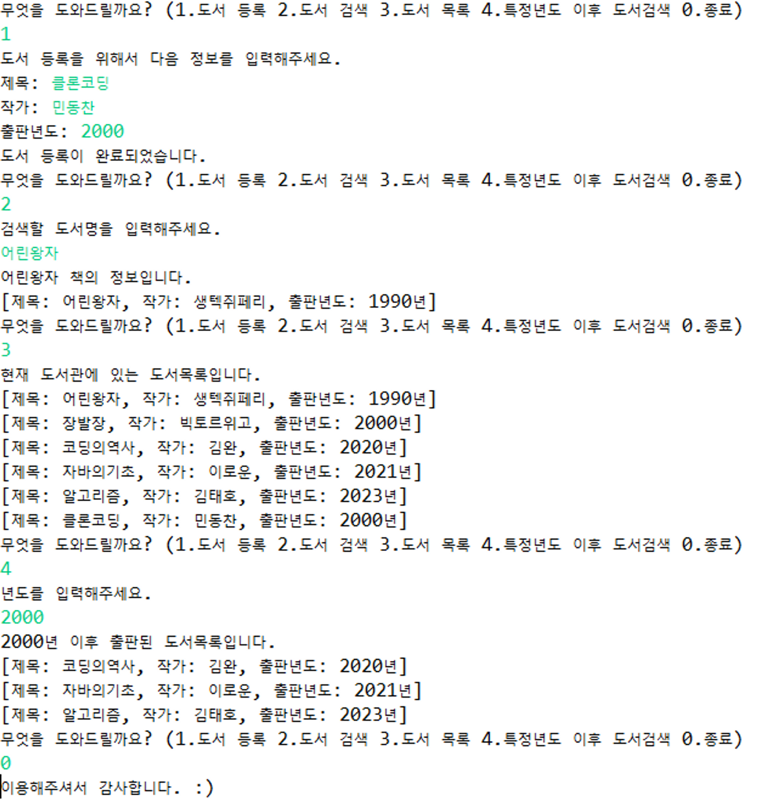

- **문제 : 도서들을 관리하는 도서 관리 시스템을 완성하시오.**

  - 요구사항

  1. **도서 추가**: 새로운 도서의 제목, 저자, 출판년도를 입력받아 도서 목록에 추가합니다.
  2. **도서 검색**: 도서의 제목을 입력받아 해당 도서의 정보를 출력합니다.
  3. **모든 도서 목록 출력**: 현재 등록된 모든 도서의 정보를 출력합니다.
  4. **특정 연도 이후 출판된 도서 목록 출력**: 사용자로부터 연도를 입력받아 해당 연도 이후에 출판된 도서들의 정보를 출력합니다.

  - 출력 예시

  

- 조건

  1. **Book 클래스** 생성 (도서 정보를 저장하는 클래스로, 제목, 저자, 출판년도 등의 필드를 포함)

     1. 필드 이름: **title**, **author**, **publicationYear**
        1. 생성자에서 인자를 받아 필드변수에 할당
        2. 필드 타입은 본인 입맛대로 선정 (int, String 추천)
     2. 각 필드에 대한 **getter 메소드**를 생성
        1. 필드는 private로 설정하고 get메소드에서 값을 불러옴.
     3. **toString() 메소드**를 생성

        ```java
        도서 정보를 문자열로 표현하여 반환
        (형식 변경가능)
         public String toString() {
        		return "[제목: " + title + ", 작가: " + author + ", 출판년도: " + publicationYear + "년]";
        	}
        ```

  2. **Library 클래스** 생성
     (Book 객체들을 관리하는 클래스로, 도서 추가, 검색, 목록 출력 등의 기능을 구현) 1. 필드 이름: **books** (도서 목록을 저장하는 리스트) 1. Book객체를 담는 리스트 필드 생성 2. 리스트 구조는 상관없음 (Linked, Array …) 2. **addBook** 메서드 생성 1. Book 타입을 인자로 받음 3. **searchBook** 메서드 생성 1. String 타입을 인자로 받음 2. 반복문 사용 3. return문 활용(break문도 가능) 4. **allbookList** 메서드 생성 1. void로 인자 안받음. 5. **afterYearBookList** 메서드 생성 1. int 타입을 인자로 받음.
  3. ****\*\*\*\*****\*\*****\*\*\*\*****메인 클래스****\*\*\*\*****\*\*****\*\*\*\***** 생성

     ```java
     // 예시 도서 리스트 추가
     		Book b1 = new Book("어린왕자", "생텍쥐페리", 1990);
     		Book b2 = new Book("장발장", "빅토르위고", 2000);
     		Book b3 = new Book("코딩의역사", "김완", 2020);
     		Book b4 = new Book("자바의기초", "이로운", 2021);
     		Book b5 = new Book("알고리즘", "김태호", 2023);

     		Library lib = new Library();

     		lib.addBook(b1);
     		lib.addBook(b2);
     		lib.addBook(b3);
     		lib.addBook(b4);
     		lib.addBook(b5);
     ```

     1. 위 코드를 복사하여 Library 객체에 기본 도서 데이터 추가하기
     2. **Scanner** 클래스를 활용하여 사용자 입력받기
     3. **반복문** 사용하여 관리시스템 반복해서 사용
     4. 조건문 (**if** or **switch문**) 사용

- 힌트 (봐도 되지만 최대한 안보고 만들어 보기!!!) -보기 전에 **직원관리시스템 프로젝트 만들 때** 기억을 떠올려보자..! - **addBook(Book book)** 메서드 : **.add()** 메서드 활용 - **searchBook(String title)**메서드 :
  리스트 안에 있는 book 객체의 필드와 비교-> **if문과 for-each문, return 활용(반복문 탈출)** - **allbookList()**메서드 : **book클래스의 toString메서드와 for-each문** 활용 - **afterYearBookList(int year)** 메서드 :
  리스트 안에 있는 book 객체의 필드와 비교-> **if문과 for-each문, toString 활용**

\*추가적인 기능 문제를 만들어 주시는 건 언제나 환영입니다…!!

- 추가 기능 구현(선택) -도서 검색 기능에서 **중복된 제목의 책이 있는 경우**, 해당 제목의 책들을 모두 출력하고,**찾는 도서가 없을 경우**, **"찾는 도서가 없습니다."**를 출력해주는 기능 추가해보기
  - ****\*\*\*\*****\*\*****\*\*\*\*****출력 예시****\*\*\*\*****\*\*****\*\*\*\*****
    
    →Iterator인터페이스와 hasNext(), next()메서드, while문 활용
    \*Iterator인터페이스를 학습해보고 풀어보기!! \*우리가 배우지 않은 내용인데 Iterator를 활용한 반복도 배우면 좋을 거 같아서 추가함.
  - 힌트 -조건문을 활용해서 검색 시, 책이 있을 때와 없을 때를 나누어 다른 출력이 되게 끔 설정

**\*풀이의 경우 완전한 정답이 아니기 때문에 출력 예시가 잘 돌아가는 지의 여부 확인이
되면 정답입니다~~ : )**

- **답** **→** 틀린 부분이 있다면 알려주세요!!

  ```java
  public class Book {

  	private String title; // 제목
  	private String author; // 작가
  	private int publicationYear; // 출판년도

  	public Book(String title, String author, int publicationYear) {
  		this.title = title;
  		this.author = author;
  		this.publicationYear = publicationYear;
  	}

  	// 도서 정보 출력
  	@Override
  	public String toString() {
  		return "[제목: " + title + ", 작가: " + author + ", 출판년도: " + publicationYear + "년]";
  	}

  //각 필드의 getter 메서드
  	// 제목
  	public String getTitle() {
  		return title;
  	}

  	// 작가
  	public String getAuthor() {
  		return author;
  	}

  	// 출판년도
  	public int getPublicationYear() {
  		return publicationYear;
  	}

  }
  ```

  ```java
  import java.util.LinkedList;
  import java.util.List;

  public class Library {

  	List<Book> books;

  	public Library() {
  		//인스턴스 생성 시, LinkedList로 생성 (다른 리스트도 상관X)
  		this.books = new LinkedList<Book>();
  	}

  	// 도서 추가
  	void addBook(Book book) {
  		books.add(book);

  	}

  	// 도서 검색 (리스트 안에 있는 book 객체의 필드와 비교-> if문과 for-each문, return 활용)
  	void searchBook(String title) {
  		for (Book book : books) {
  			if (book.getTitle().equals(title)) {
  				System.out.println(title + " 책의 정보입니다.");
  				System.out.println(book.toString());
  				return;
  			}
  		}
  		System.out.println("찾으시는 도서가 없습니다.");
  	}

  	// 모든 도서목록 출력 (book클래스의 toString메서드와 for-each문 활용)
  	void allbookList() {
  		System.out.println("현재 도서관에 있는 도서목록입니다.");
  		for (Book book : books) {
  			System.out.println(book.toString());
  		}
  	}

  	// 특정년도 이후의 도서목록 출력 (리스트 안에 있는 book 객체의 필드와 비교-> if문과 for-each문, toString 활용)
  	void afterYearBookList(int year) {
  		System.out.println(year + "년 이후 출판된 도서목록입니다.");
  		for (Book book : books) {
  			if (book.getPublicationYear() > year) {
  				System.out.println(book.toString());
  			}
  		}
  	}
  }
  ```

  ```java
  import java.util.Scanner;

  public class Run {

  	public static void main(String[] args) {
  		// 예시 도서 리스트 추가
  		Book b1 = new Book("어린왕자", "생텍쥐페리", 1990);
  		Book b2 = new Book("장발장", "빅토르위고", 2000);
  		Book b3 = new Book("코딩의역사", "김완", 2020);
  		Book b4 = new Book("자바의기초", "이로운", 2021);
  		Book b5 = new Book("알고리즘", "김태호", 2023);

  		Library lib = new Library();

  		lib.addBook(b1);
  		lib.addBook(b2);
  		lib.addBook(b3);
  		lib.addBook(b4);
  		lib.addBook(b5);

  		Scanner sc = new Scanner(System.in);

  		while (true) {

  			System.out.println("무엇을 도와드릴까요? (1.도서 등록 2.도서 검색 3.도서 목록 4.특정년도 이후 도서검색 0.종료)");
  			int num = sc.nextInt();

  			if (num == 0) {
  				System.out.println("이용해주셔서 감사합니다. :)");
  				break;
  			}

  			// 1.도서 등록
  			if (num == 1) {
  				System.out.println("도서 등록을 위해서 다음 정보를 입력해주세요.");
  				System.out.print("제목: ");
  				String title = sc.next();

  				System.out.print("작가: ");
  				String author = sc.next();

  				System.out.print("출판년도: ");
  				int year = sc.nextInt();

  				Book book = new Book(title, author, year);
  				lib.addBook(book);
  				System.out.println("도서 등록이 완료되었습니다.");

  				// 2.도서 검색
  			} else if (num == 2) {
  				System.out.println("검색할 도서명을 입력해주세요.");
  				String title = sc.next();

  				lib.searchBook(title);

  				// 3.도서 목록
  			} else if (num == 3) {
  				lib.allbookList();

  				// 4.특정년도 이후의 도서목록
  			} else if (num == 4) {
  				System.out.println("년도를 입력해주세요.");
  				int afterYear = sc.nextInt();
  				lib.afterYearBookList(afterYear);
  			}

  		}
  		sc.close();
  	}

  }
  ```

- 추가 기능 답 (배우지 않은 부분이니 보면서 학습 가능!!) → **코드리뷰는 언제나 환영!!**

  ```java
  // 도서 검색 (리스트 안에 있는 book 객체의 필드와 비교-> Iterator인터페이스와 hasNext(), next()메서드, while문 활용)
  	void searchBook(String title) {
  		//Iterator 사용
  		Iterator<Book> bookList = books.iterator();

  		//찾는 책이 있는지 없는지 판별
  		boolean hasBook = false;

  		int i = 0;
  		while(bookList.hasNext()) { // 해당 콜렉션의 다음요소가 있는지 확인 => 없으면 false 반환
  			String selectTitle = books.get(i).getTitle();
  			Book book = books.get(i);
  			bookList.next(); // 포인터 위치를 다음으로 넘김. (그래야 hasNext()메서드에서 그 다음요소를 확인할 수 있음.

  			if(selectTitle.equals(title)) {
  				System.out.println(book.toString());
  				hasBook = true;
  			}

  			i++; //다음 인덱스로 넘어감
  		}
  			if(!hasBook) {
  				System.out.println("찾으시는 도서가 없습니다.");
  			}

  	}
  ```

- 번외
  Library에서 생성하는 Book 리스트는 어떤 자료구조를 사용하면 좋을지 의논해보면 좋지 않을까? ArrayList와 LinkedList의 차이점을 확인하고 위 예제에서는 어떤 걸 선택할지…! -태호 : ArrayList가 더 효율적일 것으로 생각됨. 도서관을 생각했을 때, 도서관을 이용하는 사용자 입장에서 책을 검색하는 용도로 많이 쓰이니까 데이터 접근 속도가 빠른 ArrayList가 성능적으로 좋을 것 같음.
