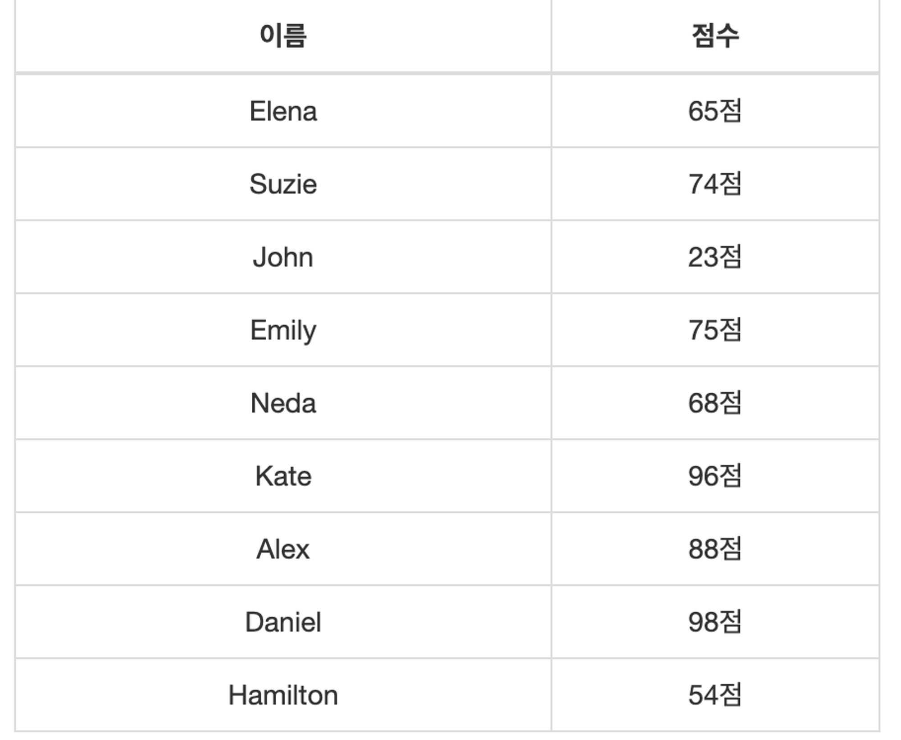
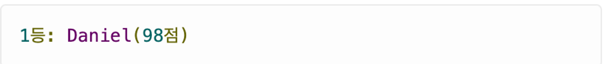

- 문제 : 성적표를 보고 최고 득점자를 뽑으려 한다 주어진 메소드를 이용하여 최고 득점자를 뽑으시오
  - 성적표
    
  - 최고 득점자를 뽑을 때는 topIndex()를 정의하고 사용하세요
  - 출력 예시
    
  - 모든 코드는 한 클래스에 정의하시오
- 해결 과정
  1. 배열을 두개 만든다 (name, score)
  2. topIndex라는 이름으로 메소드 생성
     1. 정수형 배열을 입력받아 가장 큰 값의 인덱스 반환 하는 메소드
  3. 1등 인덱스 검색
  4. `System.out.printf("1등: %s(%d점)\n", names[i], scores[i]);
사용하여 결과 출력`
- 활용코드(복사해서 쓸 것)
  ```java
  String[] names = {"Elena", "Suzie", "John", "Emily", "Neda", "Kate", "Alex", "Daniel", "Hamilton"};
  int[] scores = {65, 74, 23, 75, 68, 96, 88, 98, 54};
  ```
- 힌트
  - 인덱스를 잘 비교해보자!!!
  - 완전탐색
- 답

  ```java
  public class FirstScore {
      public static void main(String[] args) {
          // 배열 생성
          String[] names = {"Elena", "Suzie", "John", "Emily", "Neda", "Kate", "Alex", "Daniel", "Hamilton"};
          int[] scores = {65, 74, 23, 75, 68, 96, 88, 98, 54};

          // 1등 검색
          int i = topIndex(scores);

          // 결과 출력
          System.out.printf("1등: %s(%d점)\n", names[i], scores[i]);
      }
      // 메소드 생성
      public static int topIndex(int[] scores){
          int topIndex = 0;
          for(int i = 0 ; i < scores.length ; i++){
              if(scores[i] > scores[topIndex]){
                  topIndex = i;
              }
          }
          return topIndex;
      }
  }
  ```

- 번외
  1. topIndex 메서드에 static이 붙는 이유
  2. static 메서드를 사용하는 경우를 의논해보면 좋지 않을까?
