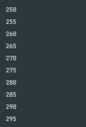

### 신발 사이즈 찍어보기

- 문제 : 배열을 활용하여 쇼핑몰에서 구매 가능한 신발사이즈 옵션을 출력하는 프로그램 작성
  조건
  - main 클래스에서 작성할 것
  - 신발 사이즈는 250부터 295까지 5단위 증가
  - 신발 사이즈 수는 총 10가지
  - 출력 예시
    
- 해결 과정
  1. 배열 하나 만들기
  2. 값 넣기
  3. 출력
- 힌트
  - 배열 하나 만들고 거기에 신발 사이즈 넣을것
  - 해당 배열 순회하면서 출력
- 답 (먼저 안풀고 답보면 멸치 됨)

  ```java
  public class Main {
      public static void main(String[] args) {
          // 배열을 활용하여 쇼핑몰에서 구매 가능한 신발 사이즈 옵션을 출력하는 프로그램 작성

          // 조건
          // 신발 사이즈는 250부터 295까지 5단위 증가
          // 신발 사이즈 수는 총 10가지

          int[] shoeSize = new int[10]; // 신발 사이즈 수는 총 10가지 => 10개짜리 배열 생성

          // 배열에 신발 사이즈 넣기
          for(int i = 0 ; i < shoeSize.length ; i++){
              shoeSize[i] = 250 + 5 * i;
          }

          // 모든 신발 사이즈 출력
          for(int shoes : shoeSize){
              System.out.println(shoes);
          }
      }
  }
  ```
