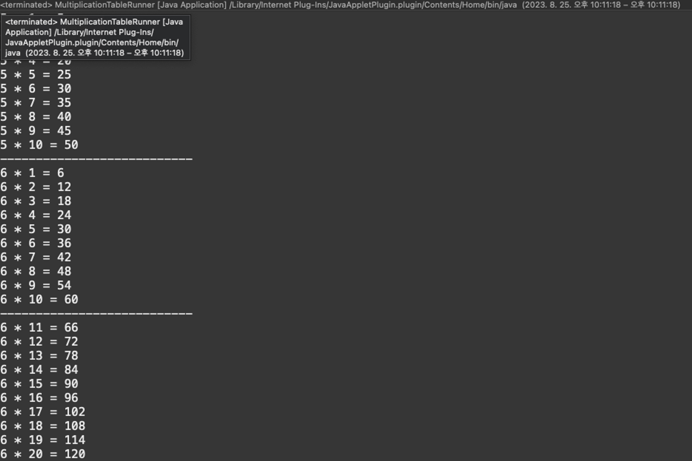

- 문제
  아래의 코드는 굉장히 반복적입니다!! 예를 들어 포멧팅의 \*를 X로 바꾸고 싶다면 모든 메소드의 코드를 바꿔야 하죠 개발자는 귀찮은 사람들이기 때문에 코드를 최대한 간단히 하고 싶습니다

  ```jsx
  public class MultiplicationTableRunner {

  	public static void main(String[] args) {
  		MultiplicationTable table = new MultiplicationTable();
  //		table.print();
  //		table.print(6);
  		table.print(6, 11, 20);
  	}

  }
  ```

  ⇒ 이 코드로 테스트 하세요

  ```jsx
  public class MultiplicationTable {
  	// 5*1 = 5
  	// 5*10 = 50

  	void print() {
  		for (int i = 1; i <= 10; i++) {
  			System.out.printf("%d * %d = %d", 5, i, 5 * i).println();
  		}
  	}

  	void print(int table) {
  		for (int i = 1; i <= 10; i++) {
  			System.out.printf("%d * %d = %d", table, i, table * i).println();
  		}
  	}

  	void print(int table, int from, int to) {
  		for (int i = from; i <= to; i++) {
  			System.out.printf("%d * %d = %d", table, i, table * i).println();
  		}
  	}

  }
  ```

  ⇒ 이 코드를 수정하세요, 중복되는 코드를 파악하고 메소드를 활용해 축약해보세요
  
  ⇒ 출력 예시

- 답

  ```jsx
  public class MultiplicationTable {
  	// 5*1 = 5
  	// 5*10 = 50

  	void print() {
  		print(5);
  	}

  	void print(int table) {
  		print(table, 1, 10);
  	}

  	void print(int table, int from, int to) {
  		for (int i = from; i <= to; i++) {
  			System.out.printf("%d * %d = %d", table, i, table * i).println();
  		}
  	}

  }
  ```
