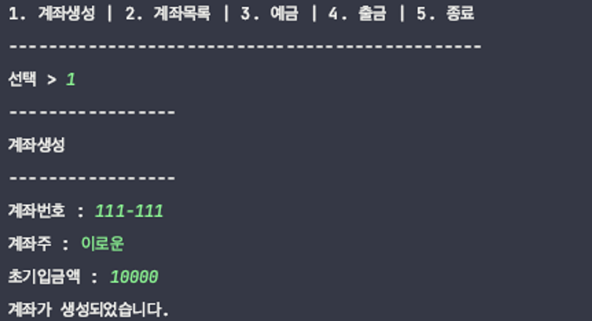
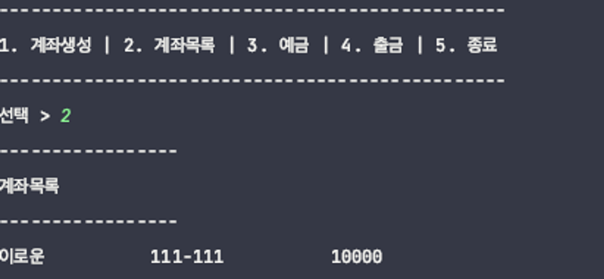
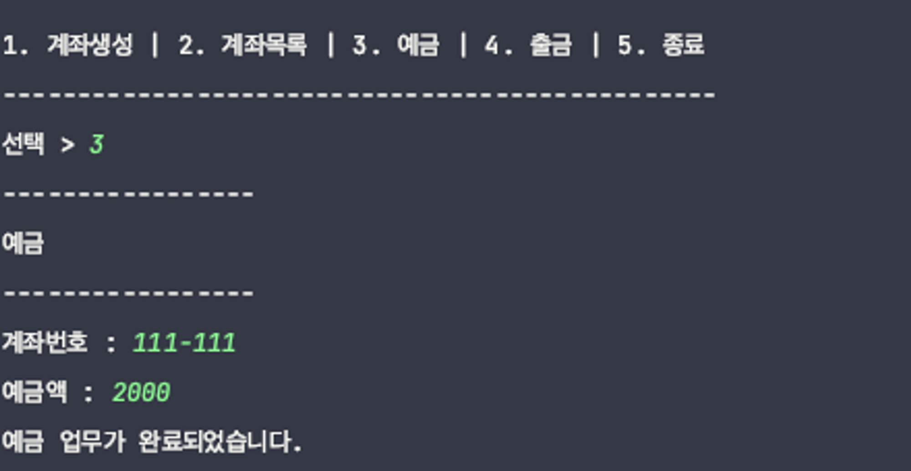
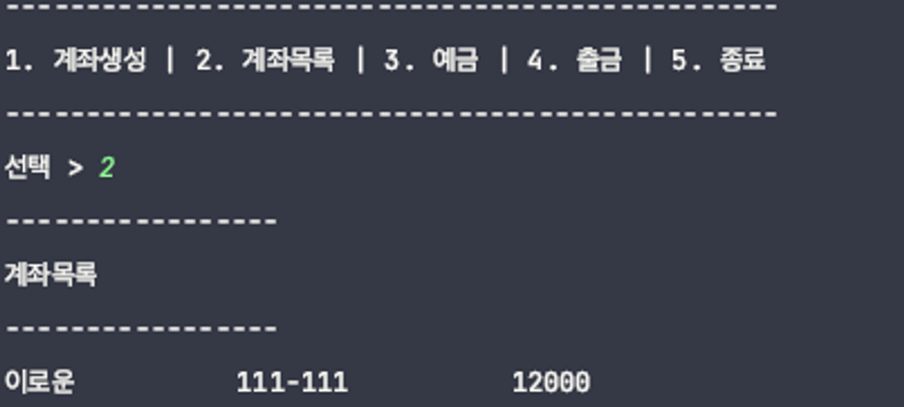
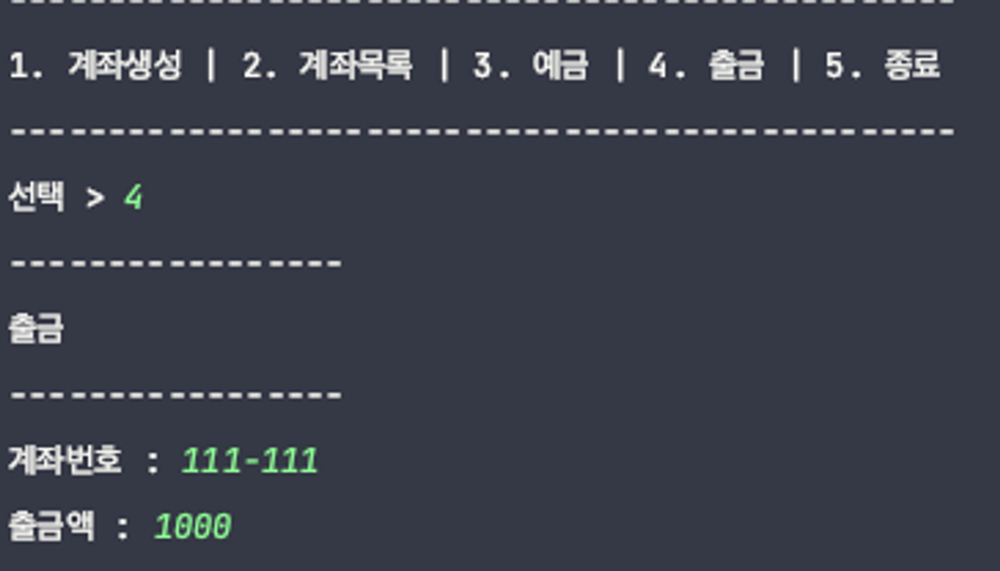
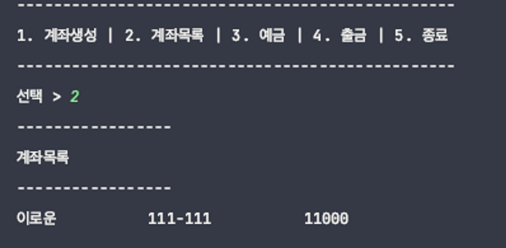
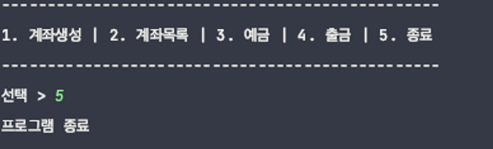

- 문제
  간단한 은행 프로그램을 만들어 봅시다!
  조건을 잘 읽고 조건에 맞게 프로그래밍 해야합니다
  - 순서
    1. 메뉴 목록에서 기능을 고른다
    2. 각각의 메뉴에 맞는 기능을 수행하도록 한다
       1. 계좌 생성은 계좌번호, 계좌주, 초기 입금액이 필요하다
       2. 계좌 목록을 볼때는 같은 계좌 정보는 일렬로 보이도록 한다
       3. 예금액을 넣으면 초기 금액에 더해져야한다
       4. 출금액을 빼면 초기 금액에서 빠져야한다
       5. 5번을 누르면 종료한다
    3. 1 ~ 2번을 반복한다
  - 출력예시
  
  
  
  
  
  
  
- 조건
  - 클래스
    - Main
    - Account
    - BankApplication
  - Main
    - 최소한의 코드를 남기세요
      - 출금, 계좌번호 같은 문구들이 나와있으면 탈락입니다
  - Account
    - accountNumber : String
    - name : String
    - initialMoney : int
    - 생성자에서 초기화
    - 모두 private으로 유지하고 getter와 setter을 사용해서 필드 변수에 직접 접근이 안되도록 하세요(캡슐화)
  - BankApplication
    - 계좌 정보를 담을 배열을 생성하세요(100개짜리)
    - 계좌 정보를 조회할때 null표시가 되지 않아야 합니다.(생성된 계좌만 보여야함)
    - 스캐너를 포함한 모든 필드 변수들은 생성자에서 초기화 시키세요
    - 계좌생성, 계좌 목록 조회, 예금, 출금 같은 기능들은 모두 이곳에서 정의하세요
    - 메소드가 하나 정도 더 필요할 겁니다.
    - 무조건 메소드를 하나 이상 추가로 만드세요
- 힌트
  - null을 컨트롤 하는 방법을 잘 생각헤보세요
  - findAccount라는 계좌를 찾는 메소드가 필요할 겁니다
  - 계좌의 일치 여부는 계좌 번호로 확인하면 됩니다
  - 캡슐화에 의해서 setter와 getter로 멤버를 조회한다는 걸 잊지마세요
- 답
  ```java
  package ch06.bankAccount;

  import java.util.Scanner;

  public class Main {
      public static void main(String[] args) {

          // 숫자 선택
          Scanner scanner = new Scanner(System.in);

          // 인스턴스 생성
          BankApplication bankApplication = new BankApplication();

          while (true) {
              System.out.println("------------------------------------------------");
              System.out.println("1. 계좌생성 | 2. 계좌목록 | 3. 예금 | 4. 출금 | 5. 종료");
              System.out.println("------------------------------------------------");

              System.out.print("선택 > ");
              int menuCode = scanner.nextInt();

              if (menuCode == 1) {
                  bankApplication.createAccount();

              } else if (menuCode == 2) {
                  bankApplication.accountList();

              } else if (menuCode == 3) {
                  bankApplication.deposit();

              } else if (menuCode == 4) {
                  bankApplication.withDraw();

              } else if (menuCode == 5) {
                  System.out.println("프로그램 종료");
                  break;
              }
          }
      }
  }
  ```
  ```java
  package ch06.bankAccount;

  public class Account {
      private String accountNumber;
      private String name;
      private int initialMoney;

      public Account(String accountNumber, String name, int initialMoney) {
          this.accountNumber = accountNumber;
          this.name = name;
          this.initialMoney = initialMoney;
      }

      public String getAccountNumber() {
          return accountNumber;
      }

      public void setAccountNumber(String accountNumber) {
          this.accountNumber = accountNumber;
      }

      public String getName() {
          return name;
      }

      public void setName(String name) {
          this.name = name;
      }

      public int getInitialMoney() {
          return initialMoney;
      }

      public void setInitialMoney(int initialMoney) {
          this.initialMoney = initialMoney;
      }
  }
  ```
  ```java
  package ch06.bankAccount;

  import java.util.Scanner;

  public class BankApplication {
      private Account[] accounts;
      private Scanner scanner;

      public BankApplication() {
          this.accounts = new Account[100];
          scanner = new Scanner(System.in);
      }

      // 계좌생성
      public void createAccount() {
          System.out.println("-----------------");
          System.out.println("계좌생성");
          System.out.println("-----------------");

          System.out.print("계좌번호 : ");
          String accountNumber = scanner.next();

          System.out.print("계좌주 : ");
          String name = scanner.next();

          System.out.print("초기입금액 : ");
          int initialMoney = scanner.nextInt();

          Account account = new Account(accountNumber, name, initialMoney);
          for(int i = 0 ; i < accounts.length; i++){
              if(accounts[i] == null){
                  accounts[i] = account;
                  System.out.println("계좌가 생성되었습니다.");
                  break;
              }
          }

      }

      //계좌목록
      public void accountList() {
          System.out.println("-----------------");
          System.out.println("계좌목록");
          System.out.println("-----------------");

          for(int i = 0 ; i < accounts.length; i++){
              Account account = accounts[i];
              if(account != null){
                  System.out.print(account.getName());
                  System.out.print("          ");
                  System.out.print(account.getAccountNumber());
                  System.out.print("          ");
                  System.out.print(account.getInitialMoney());
                  System.out.println();
              }
          }

      }

      // 예금하기
      public void deposit() {
          System.out.println("-----------------");
          System.out.println("예금");
          System.out.println("-----------------");

          System.out.print("계좌번호 : ");
          String accountNumber = scanner.next();

          Account account = findAccount(accountNumber);
          if(account == null){
              System.out.println("계좌가 존재하지 않습니다.");
              return;
          }
          System.out.print("예금액 : ");
          int money = scanner.nextInt();

          account.setInitialMoney(account.getInitialMoney() + money);
          System.out.println("예금 업무가 완료되었습니다.");

      }

      // 출금하기
      public void withDraw() {
          System.out.println("-----------------");
          System.out.println("출금");
          System.out.println("-----------------");

          System.out.print("계좌번호 : ");
          String accountNumber = scanner.next();

          Account account = findAccount(accountNumber);
          if(account == null){
              System.out.println("계좌가 존재하지 않습니다.");
              return;
          }

          System.out.print("출금액 : ");
          int money = scanner.nextInt();

          account.setInitialMoney(account.getInitialMoney() - money);

      }

      // 회원찾기
      public Account findAccount(String accountNumber){
          Account account = null;
          for(int i = 0 ; i < accounts.length ; i++){
              if(accounts[i] != null){
                  String dbAccount = accounts[i].getAccountNumber();
                   if(dbAccount.equals(accountNumber)){
                       account = accounts[i];
                   }
              }
          }
          return account;
      }

  }
  ```
