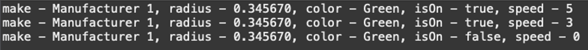

- 문제
  선풍기를 가동시키시오
  임의로 주어진 선풍기 옵션을 이용하여 제조, 반지름(팬크기), 색상, 켜져있는지유무, 속도를 출력하세요
  출력 예시는
  
  속도가 5 → 3 → 0 으로 변하고 속도가 0이 되면 선풍기도 꺼져야겠쥬?
- 조건
  - 클래스
    - Fan
    - FanRunner
  - 필드
    - String make
    - double radius
    - String color
    - boolean isOn
    - byte speed
  - 생성자 ( 생성자에 들어가야할 필드 변수는 어떤걸지 생각해보기)
  - switchOn()
  - switchOff()
  - setSpeed()
  - toString() ( Stirng.format 으로 포멧하여 사용할 것, 형식은 자유임!)
- 힌트
  - 생성자에는 5개 필드 변수중에 한개 이상이 들어가지 않습니다
  - 내가 만든 메소드를 최대한 활용해보세요
- 답
  ```jsx
  public class FanRunner {

  	public static void main(String[] args) {
  		Fan fan = new Fan("Manufacturer 1", 0.34567, "Green");

  		fan.switchOn();
  		System.out.println(fan);
  		fan.setSpeed((byte) 3);
  		System.out.println(fan);

  		fan.switchOff();
  		System.out.println(fan);

  	}

  }
  ```
  ```jsx
  public class Fan {
  	private String make;
  	private double radius;
  	private String color;
  	private boolean isOn;
  	private byte speed;

  	// 생성
  	public Fan(String make, double radius, String color) {
  		this.make = make;
  		this.radius = radius;
  		this.color = color;
  	}

  	public void switchOn() {
  		this.isOn = true;
  		setSpeed((byte) 5);
  	}

  	public void switchOff() {
  		this.isOn = false;
  		setSpeed((byte) 0);
  	}

  	public void setSpeed(byte speed) {
  		this.speed = speed;
  	}

  	// print state
  	@Override
  	public String toString() {
  		return String.format("make - %s, radius - %f, color - %s, isOn - %b, speed - %d", make, radius, color, isOn,
  				speed);
  	}

  }
  ```
