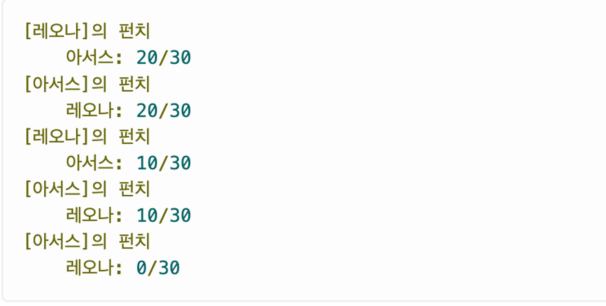
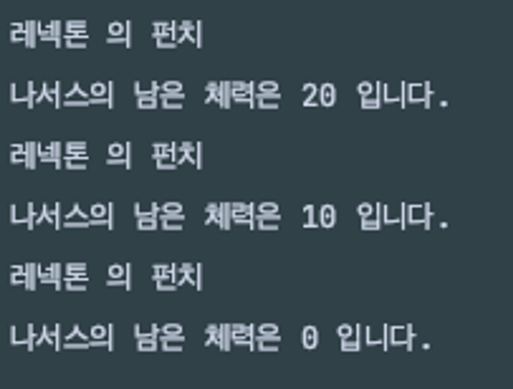

- 문제 : 아래의 출력 예와 요구사항을 만족하는 격투 게임을 완성하시오
  
  - 영웅은 펀치를 통해 상대 영웅에게 피해를 입힐 수 있다.
  - 결과창
    
- 조건
  1. Hero 클래스를 만들것
     1. 필드 변수는 name, hp
        1. 생성자를 통해서 필드변수 초기화
        2. hp는 30으로 필드에서 정의할 것
     2. punch 메소드를 생성
        1. 매개변수는 Hero타입 enemy
        2. 한번 펀치를 때리면 10씩 체력이 낮아짐
     3. battle 메소드를 생성
        1. static 메소드로 만들것
        2. 매개변수는 Hero타입 a, Hero타입 b
        3. 두 영웅 모두 체력이 남아있다면 계속 싸움 실행
        4. 2분의 1 확률로 공수 결정
           1. `Math.*random*() < 0.5` 사용
  2. 메인 메서드에서 실행
- 힌트
  - battle 메소드에서 지역 변수를 정의하여 공수를 결정하자!
  - 메소드의 존재 명분과 실행 순서를 잘 생각해보자
- 답

  ```java
  public class Hero {
      public String name;
      public int hp = 30;

      public Hero(String name){
          this.name = name;
      }

      public void punch(Hero enermy){
          enermy.hp -= 10;
          System.out.println(this.name + " 의 펀치");
          System.out.println(enermy.name + "의 남은 체력은 " + enermy.hp + " 입니다.");
      }

      public static void battle(Hero a, Hero b){
          while(a.hp > 0 && b.hp > 0){
              Hero attacker;
              Hero defencer;

              // 2분의 1 확률로 공수 결정
              if(Math.random() < 0.5){
                  attacker = a;
                  defencer = b;
              }else{
                  attacker = b;
                  defencer = a;
              }

              // 대상 공격
              attacker.punch(defencer);

          }
      }

  }
  ```

  ```java
  public class Main {
      public static void main(String[] args) {
          Hero a = new Hero("나서스");
          Hero b = new Hero("레넥톤");

          // 격투시작
          Hero.battle(a, b);

      }
  }
  ```
