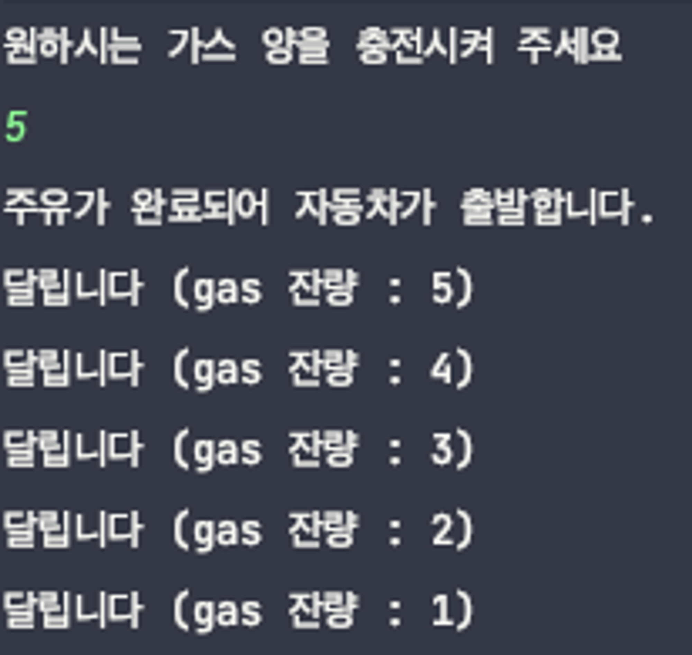

- 문제
  **자동차에 주유를 해보자**
  - 출력예시
    
- 조건
  - 필요 클래스
    - Car
    - Main
  - Main메소드에 들어갈 내용
    - Scanner(원하는 주유 량 입력받을 코드)
    - Car 클래스 인스턴스
    - **메소드 두개 이하 호출(두개 이상 호출하면 안됨!)**
  - Car 메소드에 들어갈 내용
    - 필드
      - gas
    - 메소드
      - setGas
      - move
      - isLeftGas : boolean
      - runCar
- 힌트
  최대한 Car클래스 안에서 메소드를 쪼개어 모든 처리를 진행한다
- 답

  ```java
  import java.util.Scanner;

  public class Main {
      public static void main(String[] args) {

          Scanner scanner = new Scanner(System.in);
          System.out.println("원하시는 가스 양을 충전시켜 주세요");
          int myGas = scanner.nextInt();

          Car car = new Car();

          car.move(myGas);

      }
  }
  ```

  ```java
  public class Car {
      private int gas;

      public void setGas(int gas) {
          this.gas = gas;
      }

      public void move(int gas) {
          setGas(gas);
          if (isLeftGas()) {
              runCar();
          }
      }

      public boolean isLeftGas() {
          if (this.gas == 0) {
              System.out.println("가스를 충전시켜 주세요");
              return false;
          } else {
              System.out.println("주유가 완료되어 자동차가 출발합니다.");
              return true;
          }

      }

      public void runCar() {
          while (true) {
              if (gas > 0) {
                  System.out.println("달립니다" + " (gas 잔량 : " + gas + ")");
                  this.gas -= 1;
              } else {
                  return;
              }
          }
      }
  }
  ```
