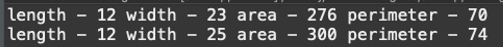

- 문제
  사각형의 길이와 너비를 확인하고 길이, 너비, 넓이, 둘레를 구하시오(perimeter)
  또한 너비를 25로 변환한 길이, 너비, 넓이, 둘레도 구하시오
  출력 예시는
  
- 조건
  주어진 사각형의 길이와 넓이는 각각 12, 23, 바꿀 너비는 25임
  - 클래스
    - Math(수학)
    - Quadrangle(사각형)
  - 필드
    - length
    - width
  - 생성자
  - toString() 을 사용해서 출력 포멧( 형식은 자유임)
  - getter , setter ( 필드 변수 직접 접근하지 말것 )
    - 이클립스 기준 단축키 : 옵션 + 컨트롤 + s 에서 getter setter 고르기
- 답
  ```jsx
  public class RectangleRunner {

  	public static void main(String[] args) {
  		Rectangle rectangle = new Rectangle(12, 23);
  		System.out.println(rectangle);
  		rectangle.setWidth(25);
  		System.out.println(rectangle);

  	}

  }
  ```
  ```jsx
  public class Rectangle {
  	private int length;
  	private int width;

  	public Rectangle(int length, int width) {
  		this.length = length;
  		this.width = width;
  	}

  	public int getLength() {
  		return length;
  	}

  	public void setLength(int length) {
  		this.length = length;
  	}

  	public int getWidth() {
  		return width;
  	}

  	public void setWidth(int width) {
  		this.width = width;
  	}

  	public int area() {
  		return length * width;
  	}

  	public int perimeter() {
  		return 2 * (length + width);
  	}

  	@Override
  	public String toString() {
  		return String.format("length - %d width - %d area - %d perimeter - %d", length, width, area(), perimeter());
  	}

  }
  ```
