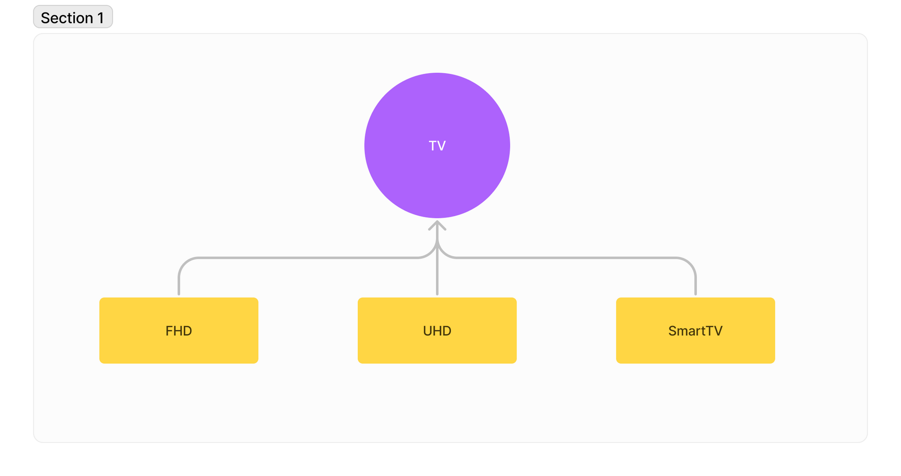

# 1페이즈

- 문제 : 각 TV의 이름과 가격을 출력하세요
  - 다이어그램
    
  - 출력 예시
    
- 조건

  - main : 출력

    - 자식 객체 세개 부모 타입으로 생성
    - 이름과 가격은 아래와 같이 생성

    ```java
    **new Fhd("FHD TV", 1500000);
    new Uhd("UHD TV", 2500000);
    new SmartTV("Smart TV", 3500000);**
    ```

    - ArrayList 배열에 자식 객체 넣기
    - for-each 문과 부모 클래스에서 정의해 놓은 toString 메소드를 활용해서 출력 예시와 같이 출력

  - TV : 부모

    - 부모 클래스에 필드 변수는 name과 price
    - 생성자에서 초기화
    - toString 메소드는 아래의 예시를 사용하여 만들 것

    ```java
    public String toString(){
        return String.format("%s: %d원", name, price);
    }
    ```

  - 나머지 : 자식
    - 생성자 만들기(부모 필드에 초기화)

- 힌트
  - 전에 풀었던 걸 상기해봅시다
- 답

  ```java
  public class Main {
      public static void main(String[] args) {
          // 객체 생성
          TV fhd = new Fhd("FHD TV", 1500000);
          TV uhd = new Uhd("UHD TV", 2500000);
          TV SmartTV = new SmartTV("Smart TV", 3500000);

          ArrayList<TV> cart = new ArrayList<TV>();
          cart.add(fhd);
          cart.add(uhd);
          cart.add(SmartTV);

          // 내역 출력
          for(TV tv : cart){
              System.out.println(tv.toString());
          }
      }
  }
  ```

  ```java
  public class TV {
      protected String name;
      protected int price;

      public TV(String name, int price){
          this.name = name;
          this.price = price;
      }

      public String toString(){
          return String.format("%s: %d원", name, price);
      }
  }
  ```

  ```java
  public class Fhd extends TV{
      public Fhd(String name, int price) {
          super(name, price);
      }
  }
  ```

  ```java
  public class Uhd extends TV{
      public Uhd(String name, int price) {
          super(name, price);
      }
  }
  ```

  ```java
  public class SmartTV extends TV {
      public SmartTV(String name, int price) {
          super(name, price);
      }
  }
  ```

# 2페이즈

- 문제 : 물가 인상으로 tv가격이 올랐습니다!
  - 출력예시
    
- 조건
  - 부모 클래스를 추상 클래스로 만들고 setPrice라는 추상 메서드 정의
  - 부모의 필드 변수 price 재정의
  - 생성자에서 메서드 실행시켜 바뀐 price 초기화
  - 자식 클래스에서 각각 가격 만원, 이만원, 삼만원 인상시킬 것
- 답

  ```java
  public abstract class TV {
      protected String name;
      protected int chagePrice;

      public TV(String name, int price){
          this.name = name;
          setPrice(price);
      }

      public String toString(){
          return String.format("%s: %d원", name, chagePrice);
      }

      public abstract void setPrice(int price);
  }
  ```

  ```java
  public class Fhd extends TV{
      public Fhd(String name, int price) {
          super(name, price);
      }

      @Override
      public void setPrice(int price) {
          chagePrice = price + 10000;
      }
  }
  ```

  ```java
  public class Uhd extends TV{
      public Uhd(String name, int price) {
          super(name, price);
      }

      @Override
      public void setPrice(int price) {
          chagePrice = price + 20000;
      }
  }
  ```

  ```java
  public class SmartTV extends TV {
      protected String open;

      public SmartTV(String name, int price) {
          super(name, price);
      }

      @Override
      public void setPrice(int price) {
          chagePrice = price + 30000;
      }
  }
  ```

# 3페이즈

- 문제 : 각 tv 기능을 뽑아보자
  - SmartTV 클래스에 넷플릭스로 접속하는 기능을 만들어보자
  - 출력 예시
    
- 조건
  - 스마트티비 클래스에 openNetflix 메소드 생성
  - 메인에서 넷플릭스 단어를 인자로 받아서 출력 예시와 같이 출력할 것
  - 메소드 호출은 메인에서 실행(가격 출력 후)
- 답

  ```java
  public class Main {
      public static void main(String[] args) {
          // 객체 생성
          TV fhd = new Fhd("FHD TV", 1500000);
          TV uhd = new Uhd("UHD TV", 2500000);
          TV SmartTV = new SmartTV("Smart TV", 3500000);

          ArrayList<TV> cart = new ArrayList<TV>();
          cart.add(fhd);
          cart.add(uhd);
          cart.add(SmartTV);

          // 내역 출력
          for(TV tv : cart){
              System.out.println(tv.toString());
          }

          Scanner scanner = new Scanner(System.in);
          System.out.print("무엇을 도와드릴까요? => ");
          String s = scanner.next();

          ((SmartTV)SmartTV).openNetflix(s);

      }
  }
  ```

  ```java
  public class SmartTV extends TV {

      public SmartTV(String name, int price) {
          super(name, price);
      }

      public void openNetflix(String open){
          if(open.equals("넷플릭스")){
              System.out.println("넷플릭스를 실행합니다.");
          }
      }

      @Override
      public void setPrice(int price) {
          chagePrice = price + 30000;
      }
  }
  ```

  다른 풀이(태호) - 아닌 것 같으면 알려주세요…!!!

  ```java
  import java.util.ArrayList;
  import java.util.Scanner;

  public class Run {

  	public static void main(String[] args) {
  		Scanner sc = new Scanner(System.in);

  		ArrayList<Tv> tvs = new ArrayList<Tv>();

  		Tv t = new Fhd("FHD", 1500000);
  		Tv t1 = new Uhd("UHD", 2500000);
  		Tv t2 = new SmartTv("SmartTv", 3500000);

  		tvs.add(t);
  		tvs.add(t1);
  		tvs.add(t2);

  		//다양한 tv 가격 출력
  		for (Tv tv : tvs) { //for-each문은 (타입 변수 : 반복문을 돌리고자하는 자료구조)
  			System.out.println(tv.toString());
  		}

  		//SmartTv 앱 실행
  		System.out.print("무엇을 도와드릴까요.=> ");
  		String appName = sc.next();
  		//다운캐스팅
  		SmartTv st =(SmartTv) t2;
  		st.openApp(appName);
  	}

  }
  ```

  ```java
  public class SmartTv extends Tv{

  	public SmartTv(String name, int price) {
  		super(name, price);
  	}

  	//SmartTv는 30000원 인상
  	@Override
  	void increasePrice() {
  		super.price += 30000;
  	}

  	//앱 실행 메소드
  	void openApp(String appName) {
  		System.out.println(appName+"를(을) 실행합니다.");
  	}

  }
  ```
