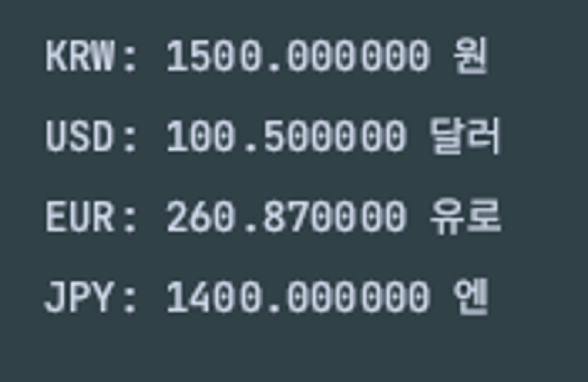

- 문제
  각국의 통화 화폐가 아래외 같이 존재한다
  
  - KRW: 한국 원화
  - USD: 미국 달라
  - EUR: 유럽 유로
  - JPY: 일본 엔화
  위 다이어그램을 통하여 출력 예시와 같이 출력하시오
  - 출력 예시
  
- 조건
  - 부모 클래스 생성
    - toString 메소드 정의
    - 부모의 toString 메소드로 자식들 필드 요소들을 모두 출력
    - toString 메서드를 만들 때는 아래 코드를 사용
      ```java
      public String toString(){
          return String.format("%s: %f %s", this.getClass().getSimpleName(), amount, notation);
      }
      ```
  - 자식 클래스 생성
    - 필드변수는 amount(타입 : double), notation(타입 : String)으로 정의할 것
    - 부모 클래스에서 생성자 초기화
  - 메인
    - 객체 인자들은 아래 참고
    ```java
    new KRW(1500, "원");
    new USD(100.50, "달러");
    new EUR(260.87, "유로");
    new JPY(1400, "엔");
    ```
    - 부모 클래스의 타입으로 배열 안에 모든 자식 객체들을 넣을 것
    - 배열에 있는 정보 출력
- 답
  ```java
  public class Currency {
      private double amount;
      private String notation;

      public Currency(double amount, String notation) {
          this.amount = amount;
          this.notation = notation;
      }

      public String toString(){
          return String.format("%s: %f %s", this.getClass().getSimpleName(), amount, notation);
      }
  }
  ```
  ```java
  public class EUR extends Currency{
      private double amount;
      private String notation;

      public EUR(double amount, String notation) {
          super(amount, notation);
      }
  }
  ```
  ```java
  public class JPY extends Currency{
      private double amount;
      private String notation;

      public JPY(double amount, String notation) {
          super(amount, notation);
      }
  }
  ```
  ```java
  public class KRW extends Currency {
      private double amount;
      private String notation;

      public KRW(double amount, String notation){
          super(amount, notation);
      }
  }
  ```
  ```java
  public class USD extends Currency{
      private double amount;
      private String notation;

      public USD(double amount, String notation) {
          super(amount, notation);
      }
  }
  ```
  ```java
  public class Main {
      public static void main(String[] args) {

          KRW krw = new KRW(1500, "원");
          USD usd = new USD(100.50, "달러");
          EUR eur = new EUR(260.87, "유로");
          JPY jpy = new JPY(1400, "엔");

          Currency[] currencies = {krw, usd, eur, jpy};

          for(Currency c : currencies){
              System.out.println(c.toString());
          }
      }
  }
  ```
