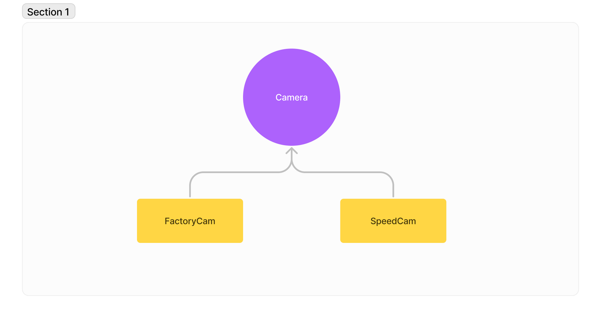
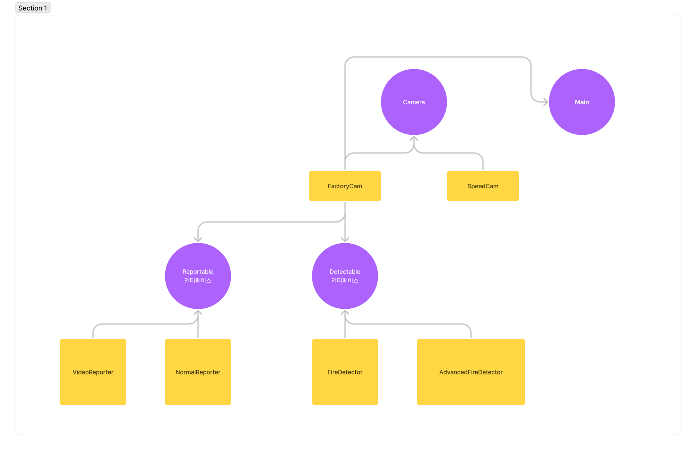
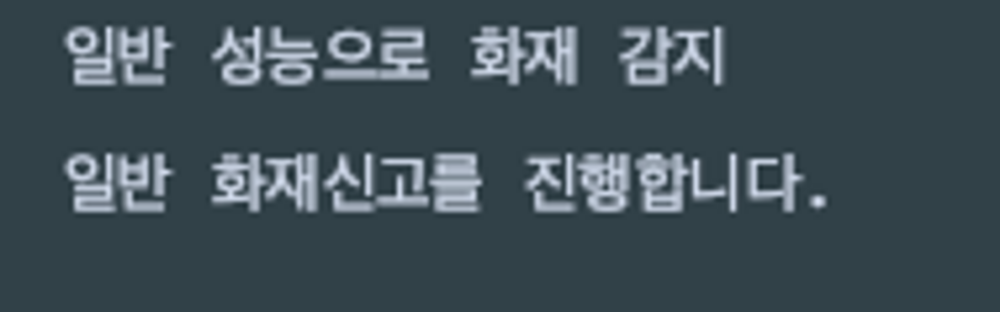
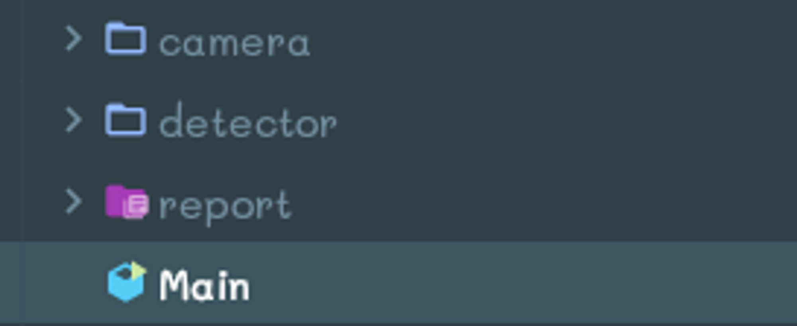

# 1페이즈

## 상속

- 문제
  각 카메라의 기능들을 뽑자!
  - 다이어그램
    
  - 출력 예시
    
- 조건
  - 카메라 클래스 생성
    - takePickture 메소드 정의
      - 사진을 촬영합니다 문구 출력
    - recordVideo 메소드 정의
      - 동영상을 녹화합니다 문구 출력
    - showMainFeature 추상 메소드 정의
  - FactoryCam 클래스 생성
    - 카메라 클래스의 자식
    - 추상메소드 오버라이딩 받을 것
  - SpeedCam 클래스 생성
    - 카메라 클래스의 자식
    - 추상 메소드 오버라이딩 받을 것
  - main
    - 부모 클래스로 업캐스팅 된 자식 객체로 출력예시와 동일하게 출력
- 답
  ```java
  public class Main {
      public static void main(String[] args) {
          Camera fc = new FactoryCam();
          Camera sc = new SpeedCam();

          fc.showMainFeature();
          sc.showMainFeature();
      }
  }
  ```
  ```java
  public abstract class Camera {
      public void takePicture(){
          System.out.println("사진을 촬영합니다.");
      }

      public void recordVideo(){
          System.out.println("동영상을 녹화합니다.");
      }

      public abstract void showMainFeature();

  }
  ```
  ```java
  public class FactoryCam extends Camera {

      @Override
      public void showMainFeature() {
          System.out.println("화재 감지");
      }
  }
  ```
  ```java
  public class SpeedCam extends Camera{
      @Override
      public void showMainFeature() {
          System.out.println("속도 측정, 번호 인식");
      }
  }
  ```

# 2페이즈

## 인터페이스

- 문제
  인터페이스의 장점을 한번 체험해보자
  - 다이어그램
  
  - 출력예시
    
- 조건
  - 패키지는 총 세개
  
  - detector 패키지
    - Detectable이라는 인터페이스 생성
      - Detect라는 추상 메서드 정의
    - FireDetector 라는 클래스 생성
      - Detectable 인터페이스를 상속받음
      - 일반 성능으로 화재 감지라는 문구를 출력해주는 기능을 가진 메서드 오버라이딩 해서 생성
    - AdvancedFireDetector 클래스 생성
      - Detectable 인터페이스를 상속받음
      - 향상된 성능으로 화재 감지라는 문구를 출력해주는 기능을 가진 메서드 오버라이딩 해서 생성
  - reporter 패키지
    - Reportable이라는 인터페이스 생성
      - Report라는 추상 메서드 정의
    - NormalReport라는 클래스 생성
      - Reportable 인터페이스 상속
      - 일반 화재신고를 진행합니다 라는 문구를 출력해주는 기능을 가진 메서드 오버라이딩 해서 생성
    - VideoReport라는 클래스 생성
      - Reportable 인터페이스 상속
      - 직전 30초 영상과 함께 신고 진행합니다 라는 문구를 출력해주는 기능을 가진 메서드 오버라이딩 해서 생성
  - camera 패키지
    - FactoryCam
      - Detectable, Reportable 인터페이스 상속
      - Detector 타입의 필드변수 생성
      - Reporter 타입의 필드 변수 생성
      - 각각 필드변수를 set 메소드를 사용해서 초기화
      - 인터페이스의 추상 메소드들을 오버라이딩 하여 각각 초기화된 필드 변수들을 이용하여 detect, report 메소드를 실행 할수있도록 기능 정의
  - 테스트 코드
  ```java
  Detectable d1 = new FireDetector();
  Reportable r1 = new NormalReporter();

  Detectable d2 = new AdvancedFireDetector();
  Reportable r2 = new VideoReporter();

  FactoryCam factoryCam = new FactoryCam();
  factoryCam.setDetector(d1);
  factoryCam.setReportable(r1);

  factoryCam.detect();
  factoryCam.report();
  ```
  main에 이 코드를 사용하여 테스트 할 것 출력이 예시와 같이 잘 나온다면 괄호 안에 d2 r2도 넣어볼 것
- 답
  어차피 report 패키지 내용은 동일해서 detect패키지 내용만 올려놓겠음
  ```java
  public class FactoryCam extends Camera implements Detectable, Reportable {
      private Detectable detector;
      private Reportable reportable;

      public void setDetector(Detectable detector) {
          this.detector = detector;
      }

      public void setReportable(Reportable reportable) {
          this.reportable = reportable;
      }

      @Override
      public void showMainFeature() {
          System.out.println("화재 감지");
      }

      @Override
      public void detect() {
          detector.detect();
      }

      @Override
      public void report() {
          reportable.report();
      }
  }
  ```
  ```java
  public interface Detectable {
      void detect();
  }
  ```
  ```java
  public class FireDetector implements Detectable{
      @Override
      public void detect() {
          System.out.println("일반 성능으로 화재 감지");
      }
  }
  ```
  ```java
  public class AdvancedFireDetector implements Detectable{
      @Override
      public void detect() {
          System.out.println("향상된 성능으로 화재를 감지합니다.");
      }
  }
  ```
